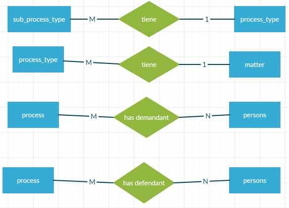
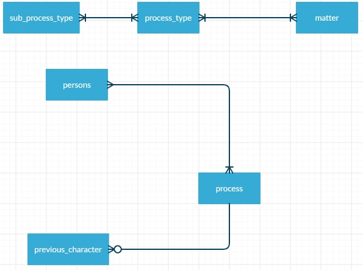
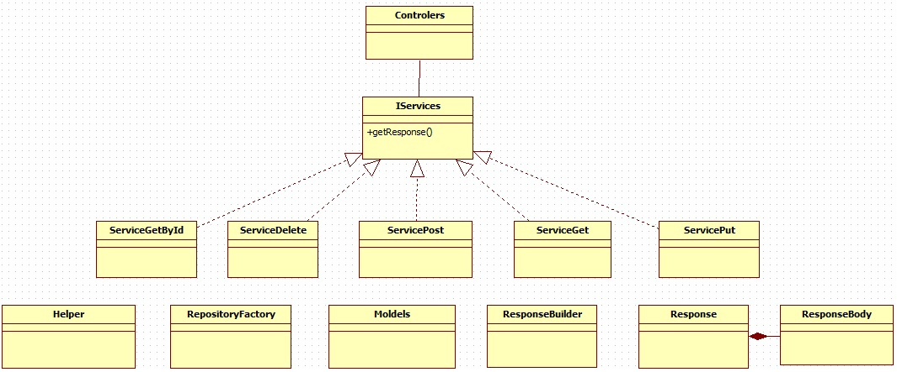
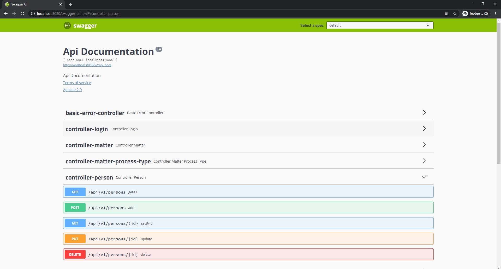
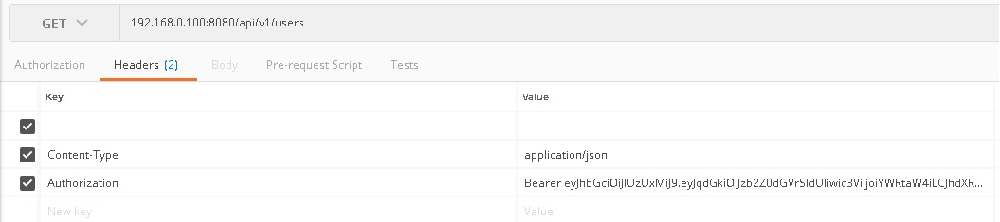

# java-spring-lawyer

This project is a lawyer process management system, it has Swagger in order to see all the endpoints and models.
also it is using token authentication or authorization.

## Prerequisites 🔨

1. Install Windows 10
2. Install gradle-6.4.1
3. Install java 1.8.0_201
4. Install Mysql 5

### Optional install mysql db in docker

0. Docker 19.03.8

1. download docker mysql image:

```
docker pull mysql:5
```

2. start container:

```
docker run -d --name mysql -e MYSQL_ROOT_PASSWORD=secret123 -p 3306:3306 mysql:5
```

3. download docker phpmyadmin image:

```
docker pull phpmyadmin/phpmyadmin:4.8
```

4. start container:

```
docker run -d --name myadmin --link mysql:db -p 8080:80 phpmyadmin/phpmyadmin:4.8
container will start in:
http://10.31.35.100:8080/
root, secret123

```

## Deploy 🚀

### Deploy Normal

0. execute all queries from sql folder
1. gradlew build
2. configure build/resources/main/application.properties
3. java -jar build/libs/java-spring-lawyer.jar

### Deploy Docker
0. execute all queries from sql folder
1. gradlew build
2. configure build/resources/main/application.properties

```
*server.address=0.0.0.0 # Bind all Docker Container 
*Mandatory: server.address=0.0.0.0
*recomended db host with ip.
```

3. create docker image

```
docker build -t java-spring-lawyer:1.0 .
```

4. run container:

```
first time: docker run -d --name java-spring-lawyer -p 8080:8080 java-spring-lawyer:1.0
then: docker start java-spring-lawyer
```

## Diagrams

### Entity relation - notation chen 

<p align="center">
  
</p>

### Entity relation - notation pata de gallo 

<p align="center">
  
</p>

### Clases

<p align="center">
  
</p>

## Usage

### Default Token: 

```
Bearer eyJhbGciOiJIUzUxMiJ9.eyJqdGkiOiJzb2Z0dGVrSldUIiwic3ViIjoiZHZlcmExIiwiYXV0aG9yaXRpZXMiOlsiUk9MRV9VU0V
SIl0sImlhdCI6MTYwMjEyMTQzMX0.Ee_NdiR3q2HY3nrjP4YY5B5sRs8udEjsZjTDqfT9MUAp8yxWTJ1FYmZZb-F50jeIyEqmQwSXlxejuadeFlI25Q
```

### Swagger Example:

```
http://localhost:8080/swagger-ui.html
```

<p align="center">
  
</p>

### API:

#### Login:

```
POST localhost:8080/api/v1/login

{
  "username": "admin",
  "password": "admin123"
  "token": "Bearer ..."
}
```

<p align="center">
  
</p>

#### Users:

```
GET localhost:8080/api/v1/users
POST localhost:8080/api/v1/users
GET localhost:8080/api/v1/users/{id}
PUT localhost:8080/api/v1/users/{id}
DELETE localhost:8080/api/v1/users/{id}

{
  "id": 1000,
  "username": "admin",
  "password": "admin123",
  "dni": "0000000",
  "name": "Admin",
  "fatherLastName": "Admin",
  "motherLastName": "Admin",
  "birthDate": "1990-01-01",
  "telephone": "76479009",
  "address": "Av. Villazon km-5",
  "email": "Admin@gmail.com",
  "type": "admin",
  "creationDate": "2020-10-16 22:46:43",
  "updateDate": null,
  "createdBy": null,
  "updatedBy": null
}
```

#### Persons:

```
GET localhost:8080/api/v1/persons
POST localhost:8080/api/v1/persons
GET localhost:8080/api/v1/persons/{id}
PUT localhost:8080/api/v1/persons/{id}
DELETE localhost:8080/api/v1/persons/{id}

{
  "id": 1000,
  "dni": "0000000",
  "name": "Karen",
  "fatherLastName": "Mendez",
  "motherLastName": "Rodriguez",
  "birthDate": "1990-01-01",
  "telephone": "76479009",
  "address": "Av. Villazon km-5",
  "email": "Admin@gmail.com",
  "creationDate": "2020-10-16 22:46:43",
  "updateDate": null,
  "createdBy": "admin",
  "updatedBy": null
}
```

#### Process:

```
GET localhost:8080/api/v1/process
POST localhost:8080/api/v1/process
GET localhost:8080/api/v1/process/{id}
PUT localhost:8080/api/v1/process/{id}
DELETE localhost:8080/api/v1/process/{id}

{
  "id": 1000,
  "description": "Robo",
  "numberProcess": "1",
  "courtNumber": "1",
  "matter": "Civil",
  "processType": "Preliminar",
  "processTypeSub": "Conciliacion previa",
  "admissionDate": "1990-01-01",
  "preliminaryAudienceDate": "1990-01-01",
  "supplementaryAudienceDate": "1990-01-01",
  "appealDate": "1990-01-01",
  "casacionDate": "1990-01-01",
  "executionSentenceDate": "1990-01-01",
  "state": "inProgress",
  "creationDate": "2020-10-16 22:46:44",
  "updateDate": null,
  "createdBy": "admin",
  "updatedBy": null
}
```

#### Person Demandant:

```
GET localhost:8080/api/v1/person-demandant
POST localhost:8080/api/v1/person-demandant
GET localhost:8080/api/v1/person-demandant/{id}
PUT localhost:8080/api/v1/person-demandant/{id}
DELETE localhost:8080/api/v1/person-demandant/{id}
GET localhost:8080/api/v1/process/{id}/person-demandant

{
  "id": 1000,
  "idProcess": 1000,
  "idPerson": 1000
}
```

#### Person Defendant:
```
GET localhost:8080/api/v1/person-defendant
POST localhost:8080/api/v1/person-defendant
GET localhost:8080/api/v1/person-defendant/{id}
PUT localhost:8080/api/v1/person-defendant/{id}
DELETE localhost:8080/api/v1/person-defendant/{id}
GET localhost:8080/api/v1/process/{id}/person-defendant

{
  "id": 1000,
  "idProcess": 1000,
  "idPerson": 1002
}
```

#### Previous Character:

```
GET localhost:8080/api/v1/previous-character
POST localhost:8080/api/v1/previous-character
GET localhost:8080/api/v1/previous-character/{id}
PUT localhost:8080/api/v1/previous-character/{id}
DELETE localhost:8080/api/v1/previous-character/{id}
GET localhost:8080/api/v1/process/{id}/previous-character

{
  "id": 1000,
  "idProcess": 1000,
  "notificationDate": "1990-01-01",
  "description": "ausencia",
  "state": "undefined",
  "creationDate": "2020-10-16 22:46:45",
  "updateDate": null,
  "createdBy": "admin",
  "updatedBy": null
}
```

#### Matter:

```
GET localhost:8080/api/v1/matter
POST localhost:8080/api/v1/matter
GET localhost:8080/api/v1/matter/{id}
PUT localhost:8080/api/v1/matter/{id}
DELETE localhost:8080/api/v1/matter/{id}

{
  "id": 1000,
  "name": "Penal
}
```

#### Process Type:

```
GET localhost:8080/api/v1/process-type
POST localhost:8080/api/v1/process-type
GET localhost:8080/api/v1/process-type/{id}
PUT localhost:8080/api/v1/process-type/{id}
DELETE localhost:8080/api/v1/process-type/{id}
GET localhost:8080/api/v1/matter/{id}/process-type

{
  "id": 1000,
  "idMatter": 1002,
  "name": "Preliminares"
}
```

#### Sub Process Type:

```
GET localhost:8080/api/v1/sub-process-type
POST localhost:8080/api/v1/sub-process-type
GET localhost:8080/api/v1/sub-process-type/{id}
PUT localhost:8080/api/v1/sub-process-type/{id}
DELETE localhost:8080/api/v1/sub-process-type/{id}
GET localhost:8080/api/v1/process-type/{id}/sub-process-type

{
  "id": 1000,
  "idProcessType": 1000,
  "name": "Conciliacion previa"
}
```

## Contributing

1. Fork it!
2. Create your feature branch: `git checkout -b feature/1001`
3. Commit your changes: `git commit -m 'feature/1001: Add some feature'`
4. Push to the branch: `git push origin feature/1001`
5. Submit a pull request.

## License

- Free.
